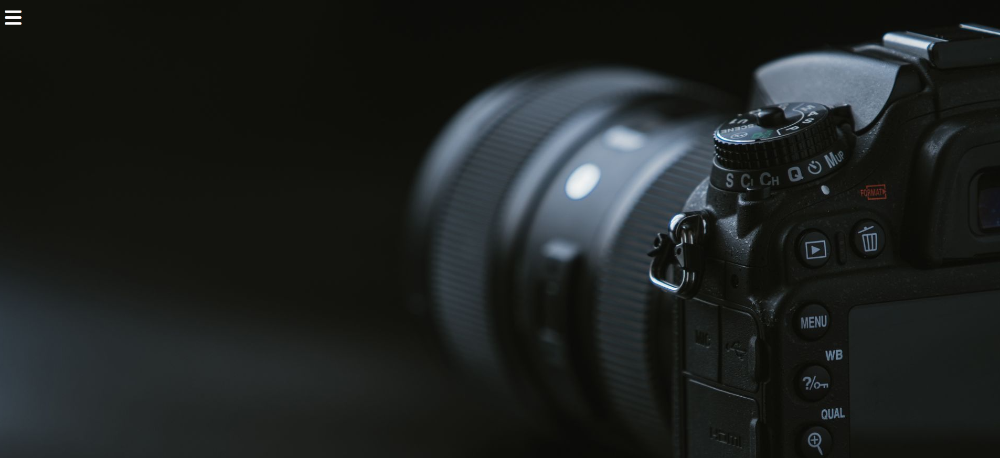
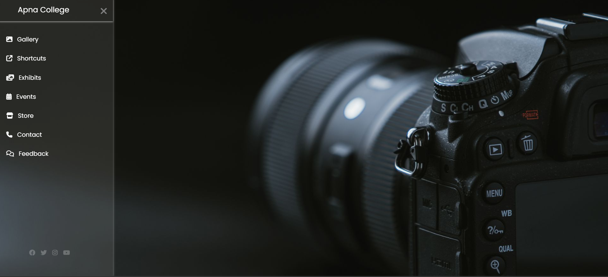

# responsive-sidebar-menu
Creative button UI designs built with HTML &amp; CSS — made while learning frontend through the Delta Batch by Apna College. 🎨

## 💻 Project Output

### 🔸 Default View (Sidebar Closed)


### 🔹 Sidebar Opened



# Responsive Sidebar Menu

This is a responsive and animated sidebar menu built using only **HTML and CSS** — without a single line of JavaScript!  
The menu appears using the checkbox hack and CSS transitions, providing a clean and lightweight UI.

## 🌟 Features
- Sidebar toggle without JavaScript
- Smooth animations using CSS transitions
- Fully responsive layout
- Social media icons included
- Minimal and modern design

## 🛠 Tech Used
- HTML5
- CSS3
- Font Awesome
- Google Fonts (Poppins)

## 📚 Created during Delta Batch (Apna College)
Made with guidance from **Shraddha Didi (Apna College)** as a part of the **Delta Batch** journey.

## 🔧 How to Use
1. Clone the repository:
   ```bash
   git clone https://github.com/Palak-Dwivedi20/responsive-sidebar-menu.git
